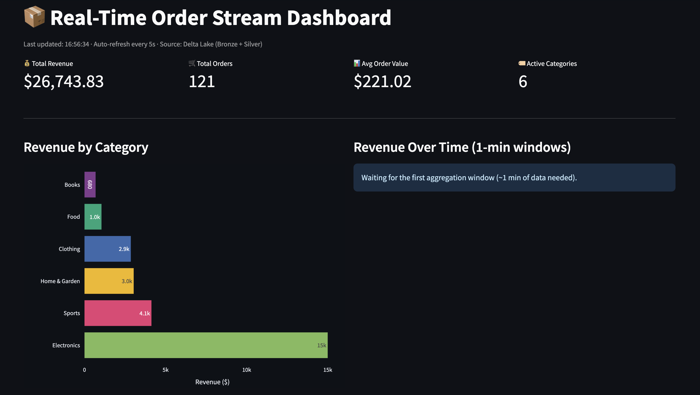
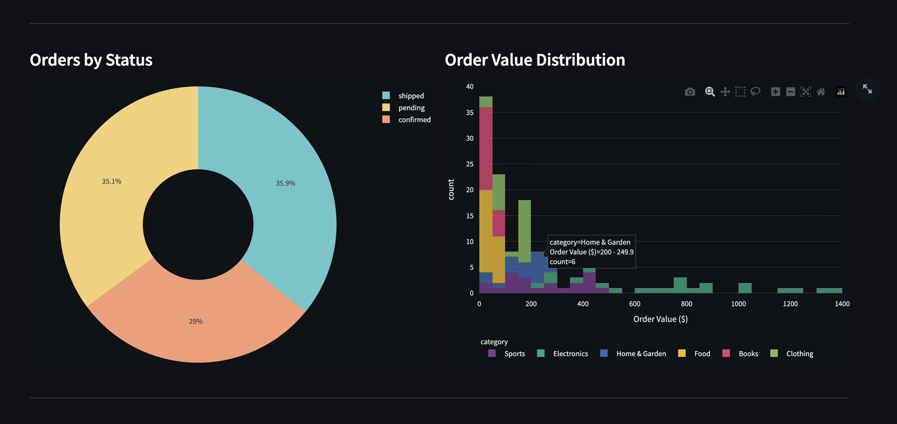

# Real-Time E-Commerce Order Processing Pipeline


A production-style streaming data pipeline that ingests real-time e-commerce order events through **Apache Kafka**, processes them with **Apache Spark Structured Streaming**, stores results in **Delta Lake** using the Medallion architecture, and visualizes live metrics on a **Streamlit** dashboard.

---

## Dashboard Preview





---

## Architecture

### Pipeline Overview


> Diagram source: [`docs/diagrams/architecture.drawio`](docs/diagrams/architecture.drawio) · Edit with [draw.io](https://app.diagrams.net)

### Medallion Data Layers


> Diagram source: [`docs/diagrams/medallion.drawio`](docs/diagrams/medallion.drawio) · Edit with [draw.io](https://app.diagrams.net)

---

## How It Works

```
order_producer.py          Kafka Topic         order_processor.py
  (Faker events)    ──▶    "orders"     ──▶   (Spark Structured Streaming)
                                                      │
                                     ┌────────────────┴────────────────┐
                                     ▼                                 ▼
                             🥉 Bronze Layer                   🥈 Silver Layer
                             delta/raw_orders                  delta/aggregated
                             (all raw events)                  (windowed revenue
                              append mode                       per category)
                                     │                                 │
                                     └────────────┬────────────────────┘
                                                  ▼
                                         dashboard/app.py
                                      (Streamlit · auto-refresh 5s)
```

1. **Producer** generates realistic order events using Faker and publishes them to Kafka at a configurable rate.
2. **Spark** reads the stream, enforces a JSON schema, applies a 2-minute watermark, and writes two sinks simultaneously.
3. **Bronze** stores every raw event as-is (append-only Delta table).
4. **Silver** stores 1-minute tumbling window aggregations per product category (revenue, order count, average value).
5. **Dashboard** reads both Delta tables every 5 seconds and renders live charts.

---

## Tech Stack

| Layer | Technology | Version |
|-------|-----------|---------|
| Message Broker | Apache Kafka (Confluent) | 7.5.0 |
| Stream Processing | Apache Spark Structured Streaming | 3.5.0 |
| Storage Format | Delta Lake | 3.1.0 |
| Orchestration | Docker Compose | — |
| Producer | Python + kafka-python | 3.10 / 2.0.2 |
| Data Generation | Faker | 24.0.0 |
| Dashboard | Streamlit + Plotly | 1.32.0 / 5.20.0 |
| Delta Reader (dashboard) | deltalake (delta-rs) | 0.17.4 |

---

## Project Structure

```
spark-kafka/
├── docker-compose.yml          # Kafka + Zookeeper + Kafka UI + topic init
├── requirements.txt
├── producer/
│   └── order_producer.py       # Simulates real-time order events
├── streaming/
│   ├── order_processor.py      # Spark Structured Streaming job
│   └── query_delta.py          # Batch queries against Delta tables
├── dashboard/
│   └── app.py                  # Streamlit real-time dashboard
├── docs/
│   ├── diagrams/               # draw.io architecture diagrams
│   └── screenshots/            # dashboard screenshots
├── delta/                      # Created at runtime — git-ignored
│   ├── raw_orders/             # 🥉 Bronze: raw events (append)
│   ├── aggregated/             # 🥈 Silver: windowed aggregations
│   └── checkpoints/            # Spark streaming checkpoints
└── README.md
```

---

## Data Model

### Order Event (Kafka message payload)

```json
{
  "order_id":  "3f7a1b2c-4d5e-6f7a-8b9c-0d1e2f3a4b5c",
  "user_id":   "9d4e5f6a-7b8c-9d0e-1f2a-3b4c5d6e7f8a",
  "product":   "Laptop",
  "category":  "Electronics",
  "amount":    749.99,
  "quantity":  1,
  "status":    "confirmed",
  "timestamp": "2024-01-15T10:30:00.123456"
}
```

### Silver Aggregation Schema (Delta Lake)

| Column | Type | Description |
|--------|------|-------------|
| `window_start` | Timestamp | Start of the 1-minute tumbling window |
| `window_end` | Timestamp | End of the 1-minute tumbling window |
| `category` | String | Product category |
| `total_revenue` | Double | Sum of order amounts in the window |
| `order_count` | Long | Number of orders in the window |
| `avg_order_value` | Double | Average order value |
| `max_order_value` | Double | Largest single order |
| `total_units_sold` | Long | Sum of quantities |

---

## Prerequisites

| Requirement | Version | Check |
|-------------|---------|-------|
| Python | 3.9+ | `python3 --version` |
| Java (JDK) | 11+ | `java -version` |
| Docker Desktop | any | `docker --version` |

> **macOS**: Install Java with `brew install openjdk@11`

---

## Quick Start

### 1. Clone and install dependencies
```bash
git clone https://github.com/<your-username>/spark-kafka.git
cd spark-kafka
pip install -r requirements.txt
```

### 2. Start Kafka
```bash
docker-compose up -d
```

Verify all containers are healthy:
```bash
docker-compose ps
```

Kafka UI → **http://localhost:8080**

### 3. Start the Spark Streaming job
```bash
# Open a new terminal
python streaming/order_processor.py
```

> First run downloads ~60 MB of JARs from Maven — wait for the `=== Order Stream Processor running ===` message.

### 4. Start the Order Producer
```bash
# Open a new terminal
python producer/order_producer.py              # 1 order/sec, forever
python producer/order_producer.py --rate 0.2   # 5 orders/sec
python producer/order_producer.py --max-orders 500  # stop after 500
```

### 5. Launch the Streamlit Dashboard
```bash
# Open a new terminal
streamlit run dashboard/app.py
```

Dashboard → **http://localhost:8501** · Auto-refreshes every 5 seconds.

### 6. Query Delta tables from CLI (optional)
```bash
python streaming/query_delta.py
```

---

## Key Engineering Concepts

| Concept | Implementation |
|---------|---------------|
| Kafka producer with serialization | [`producer/order_producer.py`](producer/order_producer.py) |
| Spark Structured Streaming from Kafka | [`streaming/order_processor.py`](streaming/order_processor.py) |
| JSON schema enforcement | `ORDER_SCHEMA` — explicit `StructType` definition |
| Watermarking for late data handling | `.withWatermark("event_time", "2 minutes")` |
| Tumbling window aggregation | `window(col("event_time"), "1 minute")` |
| Medallion architecture (Bronze / Silver) | Two independent Delta sinks in `order_processor.py` |
| Delta Lake ACID streaming writes | `format("delta")` with checkpoint locations |
| Fault-tolerant exactly-once processing | `checkpointLocation` per streaming query |
| Concurrent batch reads on a streaming table | `deltalake` (delta-rs) in dashboard |
| Micro-batch trigger control | `.trigger(processingTime="10 seconds")` |

---

## Stopping the Pipeline

```bash
# Ctrl+C in the producer terminal
# Ctrl+C in the Spark terminal
docker-compose down          # stop Kafka
rm -rf delta/                # optional: wipe stored data
```

---

## Troubleshooting

| Error | Cause | Fix |
|-------|-------|-----|
| `JAVA_GATEWAY_EXITED` | Java not found | `brew install openjdk@11` + set `JAVA_HOME` |
| `UnknownTopicOrPartitionException` | Topic doesn't exist yet | `docker-compose down -v && docker-compose up -d` |
| `DELTA_UNSUPPORTED_OUTPUT_MODE` | Delta doesn't support `update` mode | Use `outputMode("append")` with watermark |
| `NoBrokersAvailable` | Kafka not ready | Wait for `docker-compose ps` to show `healthy` |
| `NodeExistsException` in Zookeeper | Stale container state | `docker-compose down -v && docker-compose up -d` |

---

## Phase 2 — Databricks (coming soon)

The same pipeline rebuilt on the cloud:

- **Confluent Cloud** — hosted Kafka (free tier)
- **Databricks Auto Loader** — incremental file ingestion from cloud storage
- **Delta Live Tables** — declarative pipeline with data quality expectations
- **Unity Catalog** — governance, lineage, and access control

---

## License

MIT
